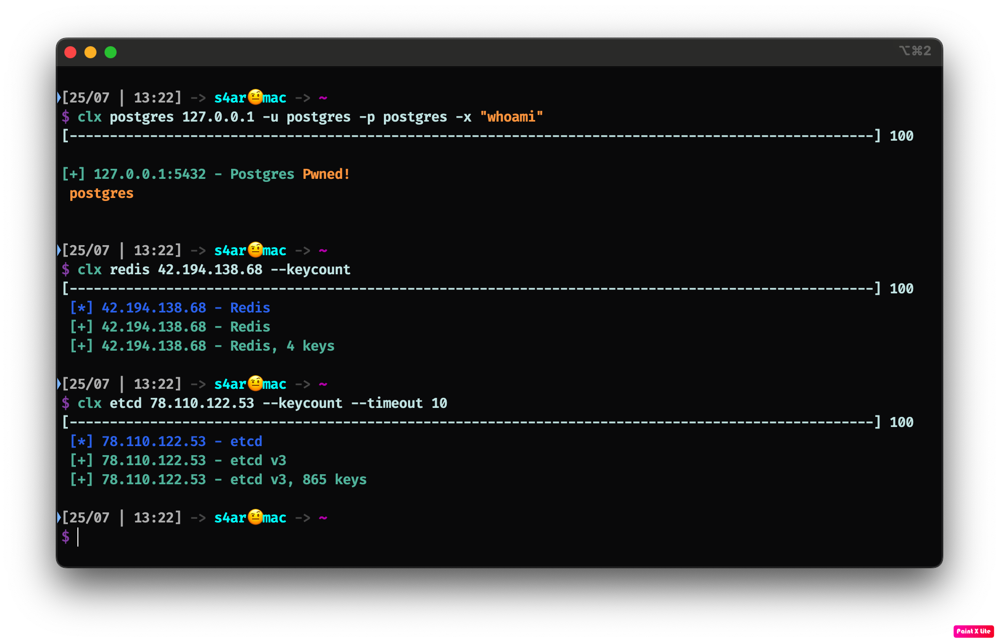

# CloudExec - Cloud Execution Tool

This utility is designed to scan, detect, exploit vulnerabilities and services misconfigurations in cloud and dev linux infrastructures. The selected modes were services commonly found in such environments, as well as the search and testing processes I wanted to automate :)

Here are mods for scan some services
- Grafana
- Postgres
- Registry
- Gitlab
- Zookeeper
- Kafka
- Kube
- Etcd
- Redis
- Consul

# Usage: 
```shell
#Common service discovery
clx ModeName <ip/network/hostname>

#Take hosts from list
clx ModeName -i hosts.txt

#Using module on all found hosts
clx ModeName <ip/network/hostname> -M moduleName
```

### Legend
Blue highlighting - Target found `[*] 192.168.1.1 - Service`

Green highlighting - Target found and access granted  `[+] 192.168.1.1 - Service`

Yellow highlighted `Pwned` - You can execute code (RCE)

# Grafana
This mode  is designed to discover & exploit Grafana. It will scan and highlight all found hosts with grafana service

**Modules**:
* **datasources** - Displays a list of all available sources for the specified account. By querying the data sources, you can retrieve the data stored in them (require `-u` and `-p` flags for authenticate)
* **defcreds** - Try to authenticate with popular creds
* **ssrf** - send http request to one target or all targets in network on behalf of Grafana. If you want to scan an entire `network` of hosts or specific host using ssrf, you need to specify the `--ssrf-target` and `--ssrf-port` flags. You can also specify the `--timeout` flag if Grafana is unable to process the request for some reason.

**Examples:** 
```bash
clx consul 127.0.0.1 -M ssrf --ssrf-target https://google.com
clx consul 127.0.0.1 --port 443 --ssrf-network 192.168.1.0/24 --ssrf-port 8080
```


# Postgres
This mode  is designed to discover & exploit Postgres. It will scan and highlight all found hosts. If the creds are correct, then it will automatically check if the user is a superuser and if so, a yellow Pwned label will appear, indicating RCE capability

Code execution: `clx postgres <ip> -x id`


# Registry
This mode  is designed to discover & exploit some registries/artifactories. In common mode, without any modules it will scan and highlight all found hosts with **docker registry** service.

**Modules**:
* **images** - Displays a list of all available docker images in define registry
* **harbor** - Get all artifacts from Harbor registry - containers build history, helm charts values.yml. Often a `--timeout` flag is required. (Found out experimentally)


# Gitlab
This mode  is designed to discover & exploit Gitlab. It will scan and highlight all found hosts with Gitlab service.

**Modules**:
* **loginbypass** - try endpoints to bypass the login page and get public projects
* **accesslvl** - check personal and group access token's rights of all available projects (Require --token flag)
* **clone** - clone all available repositories. **Add `--public` flag if u want to clone public repositories**
* **runnerrce** - will be clone repo by `--pjid`, create new branch with evil `gitlab-ci.yaml`, maybe make revshell(`--revshell` flag) or execute command with output (`-x`) 
 

# Zookeeper
This mode  is designed to discover & exploit Zookeeper. It will scan and highlight all found targets.

Also this mode will you can also use this mode to get and list znodes
```shell
#list znode on path
clx zk <ip> --list /

#get znode on path
clx zk <ip> --get /zookeeper
```


# Kafka
This mode  is designed to discover & exploit kafka. It will scan and highlight all found targets.

**Modules**:
* **topics** - display all available topics in the broker. if the `--topic` flag is set, then the module will read the contents of the selected topic (`clx kafka <ip> -M topics --topic sometopicname`), .


# Kube
This mode  is designed to discover & exploit kube. It will scan and highlight all found **kubernetes** and **kubelet** api. If the api is not closed behind authentication, the tool will highlight this

# Etcd
This mod is designed to discover etcd. It will scan and highlight all found **v2** and **v3** etcd api. If the api is not closed behind authentication, the tool will highlight this. Also `--keycount` flag will calculate count avaible keys in storage. 

# Redis
This mod is designed to discover redis. It will scan and highlight all found redis ports. If auth is not required -  the tool will highlight this. Also `--keycount` flag will calculate count avaible keys in storage. Also can brute passwords `-p` flag.

# Consul
This mode  is designed to discover & exploit Consul. It will scan and highlight all found hosts. If `ACLsEnabled` option is set to false so the api is not closed behind authentication, the tool will highlight this with `green`.
If `EnableLocalScriptChecks` and `EnableRemoteScriptChecks` options are set to true a `yellow Pwned` label will appear, indicating RCE capability

Code execution: `clx postgres <ip> -x id`

**Modules**:
* **ssrf** - send http request to one target or all targets in network on behalf of Consul. If you want to send a request to a specific target, you need to specify the `--ssrf-target` flag. If you want to scan an entire `network` of hosts using ssrf, you need to specify the `--ssrf-network` and `--ssrf-port` flags. You can also specify the `--timeout` flag if Consul is unable to process the request for some reason.

**Examples:** 
```bash
clx consul 127.0.0.1 -M ssrf --ssrf-target https://google.com
clx consul 127.0.0.1 --port 443 --ssrf-network 192.168.1.0/24 --ssrf-port 8080
```


# Install
Go 1.23+

`$ go install github.com/cotsom/CloudExec@latest`

# Module writing
You can add your own module using e.g. `cobra-cli add <commandName>` command.  This will create a new file in the `cmd/` directory containing the code template for the new command.

#### Template for new mode:
test mode

test module

*In the Run function you can implement your own logic for receiving and parsing flags, targets and scans*

